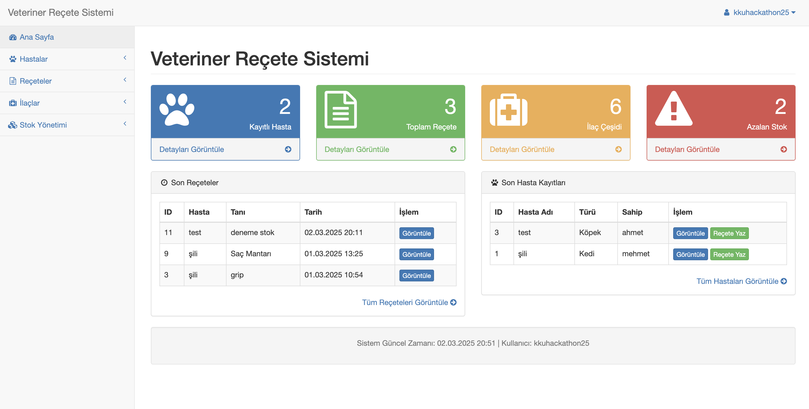
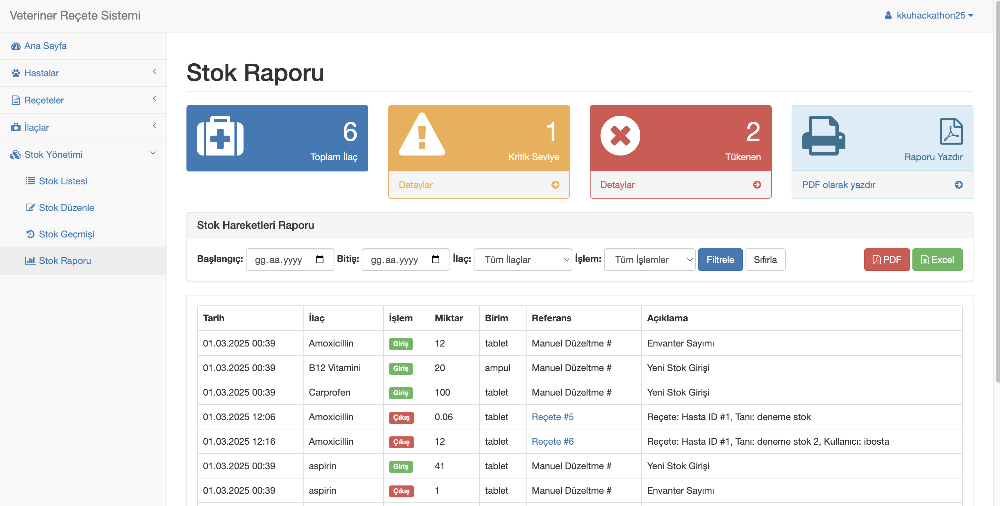

# 🐾 Veteriner Reçete Sistemi


[](#-versiyon-güncelleme-notları)


Bu proje, veteriner hekimlerin hasta hayvan bilgilerini yönetmesine, reçete oluşturmasına ve ilaç stoklarını takip etmesine olanak sağlayan kapsamlı bir yönetim sistemidir. Kırıkkale Üniversitesi Hackathon etkinliği için geliştirilmiştir.


## 👁️ Demo


https://ibosta.tech/kkuhackathon25

## 📋 Özellikler

### Hasta Yönetimi
- Hayvan hastaları için detaylı kayıt oluşturma
- Sahip bilgileri ile birlikte hasta geçmişini takip
- Türe ve ırka göre filtreleme ve arama
- Hasta geçmişinde tüm tedavi ve reçeteleri görüntüleme

### Reçete Sistemi
- Kapsamlı reçete oluşturma arayüzü
- Tanı ve ilaç bilgilerini detaylı olarak kaydetme
- Otomatik PDF reçete oluşturma ve yazdırma
- Reçete geçmişinde filtreleme ve arama

### İlaç ve Stok Takibi
- İlaç stoklarını gerçek zamanlı olarak izleme
- Reçete yazarken otomatik stoktan düşme
- Düşük stok uyarı sistemi
- Stok giriş ve çıkışlarının tam kaydı
- Stok geçmişi ve hareket raporu

### Kullanıcı Yönetimi
- Rol tabanlı yetkilendirme (Yönetici ve Veteriner Hekim)
- Güvenli oturum yönetimi
- İki faktörlü kimlik doğrulama (2FA) desteği
- Kullanıcı işlemlerinin kaydı

### Raporlama
- Dönemsel reçete raporları
- İlaç kullanım analizleri
- Hasta ziyaret istatistikleri
- Excel ve PDF formatında dışa aktarım

## 🔧 Teknik Özellikler

- **Veritabanı Yapısı**: İlişkisel veritabanı mimarisi ile tüm veriler arası ilişkiler korunur
- **Güvenlik**: SQL enjeksiyonu ve XSS saldırılarına karşı koruma
- **Veritabanı İşlemleri**: İşlem (transaction) bazlı veri güvenliği
- **Performans**: Optimize edilmiş sorgular ve indeksler ile hızlı çalışma
- **Oturum Yönetimi**: Güvenli çerezler ve oturum kontrolleri
- **Responsive Tasarım**: Tüm cihazlarda sorunsuz kullanım için Bootstrap tabanlı arayüz
- **PDF Motoru**: Reçete ve raporlar için entegre PDF oluşturma
- **Depolama**: Hasta ve reçete dökümanları için dosya depolama sistemi

## 💻 Gereksinimler

- PHP 7.2 veya daha yüksek
- MySQL 5.7 veya daha yüksek
- Web sunucusu (Apache, Nginx vb.)
- PDO PHP Eklentisi
- GD Library (resim işleme için)
- MBString Extension (UTF-8 desteği için)

## 📦 Kurulum

1. Projeyi bilgisayarınıza klonlayın:
   ```bash
   git clone https://github.com/ibosta/php-veteriner-sistemi.git
   ```

2. Dosyaları web sunucunuza yükleyin veya yerel geliştirme ortamınızda (XAMPP, MAMP vb.) uygun konuma kopyalayın.

3. MySQL veritabanı oluşturun.

4. Projeyle birlikte gelen `veteriner_db.sql` dosyasını kullanarak veritabanı tablolarını oluşturun:
   ```bash
   mysql -u kullanıcı_adı -p veritabanı_adı < veteriner_db.sql
   ```
   
   Alternatif olarak phpMyAdmin üzerinden SQL dosyasını içe aktarabilirsiniz.

5. `config/config.php` dosyasını düzenleyerek veritabanı bağlantı bilgilerinizi girin:
   ```php
   define('DB_HOST', 'localhost');
   define('DB_USER', 'kullanici_adi');
   define('DB_PASSWORD', 'sifre');
   define('DB_NAME', 'veteriner_db');
   ```

6. Web tarayıcınızda projeye giderek kurulumun başarılı olduğundan emin olun.

## 🚀 Kullanım

### Sisteme Giriş

Sisteme iki farklı kullanıcı tipi ile giriş yapabilirsiniz:

- **Yönetici Girişi:**
  - Kullanıcı adı: kkuhackathon25
  - Şifre: admin
  - Tam yönetim yetkilerine sahiptir

- **Veteriner Girişi:**
  - Kullanıcı adı: test
  - Şifre: 123456
  - Hasta ve reçete işlemleri yapabilir

### Temel İşlemler

1. **Hasta Yönetimi**
   - Yeni hasta kaydı oluşturma
   - Hasta bilgilerini güncelleme
   - Sahip bilgilerini yönetme
   - Hasta arama ve filtreleme

2. **Reçete İşlemleri**
   - Yeni reçete oluşturma
   - Hastaya uygun ilaç seçme
   - Doz ve kullanım talimatları ekleme
   - PDF çıktı alma ve e-posta gönderimi

3. **İlaç ve Stok Yönetimi**
   - Yeni ilaç tanımlama
   - Stok girişi yapma
   - Stok seviyelerini kontrol etme
   - Stok hareketlerini raporlama

4. **Raporlama**
   - Günlük, haftalık, aylık reçete raporları
   - İlaç kullanım istatistikleri
   - Hasta ziyaret analizi
   - Excel/CSV formatında dışa aktarım

## 🧩 Sistem Mimarisi

Proje, modüler bir yapıda tasarlanmış olup birbirinden bağımsız çalışabilen aşağıdaki bileşenlerden oluşmaktadır:

- **Kullanıcı Modülü**: Kimlik doğrulama ve yetkilendirme
- **Hasta Modülü**: Hayvan ve sahip bilgileri yönetimi
- **Reçete Modülü**: Reçete oluşturma ve takibi
- **İlaç Modülü**: İlaç katalog yönetimi
- **Stok Modülü**: İlaç stok takibi ve hareketleri
- **Rapor Modülü**: Çeşitli raporlama fonksiyonları

Sistem, MysqliDb veritabanı sınıfını kullanarak veritabanı işlemlerini gerçekleştirir ve bootstrap tabanlı responsive bir arayüz sunar.

## 🔩 Veritabanı Yapısı

Veritabanı yapısı, aşağıdaki ana tablolardan oluşmaktadır:

- **admin_accounts**: Yönetici kullanıcılar
- **users**: Veteriner kullanıcılar
- **patients**: Hayvan hastaları
- **prescriptions**: Reçeteler
- **prescription_items**: Reçete kalemleri
- **medications**: İlaçlar
- **stock**: İlaç stokları
- **stock_history**: Stok hareketleri
- **stock_entries**: Stok girişleri
- **stock_entry_items**: Stok giriş kalemleri

Tam veritabanı yapısı için proje kök dizinindeki `veteriner_db.sql` dosyasını inceleyebilirsiniz.

<a name="version-updates"></a>
## 📄 Versiyon Güncelleme Notları
### Version 1.1.0
   - PHP 7.4.33 Sürümünden 8.2.0 Sürümüne geçildi.
   - Uyumsuzluk hataları giderildi.
### Version 1.1.1
   - Stok Tablosu Tarih aralığı indirme eklendi. Stok takibi iyileştirildi.


## 📜 Lisans

Bu proje MIT lisansı altında lisanslanmıştır. Detaylar için [LICENSE](LICENSE) dosyasını inceleyebilirsiniz.
